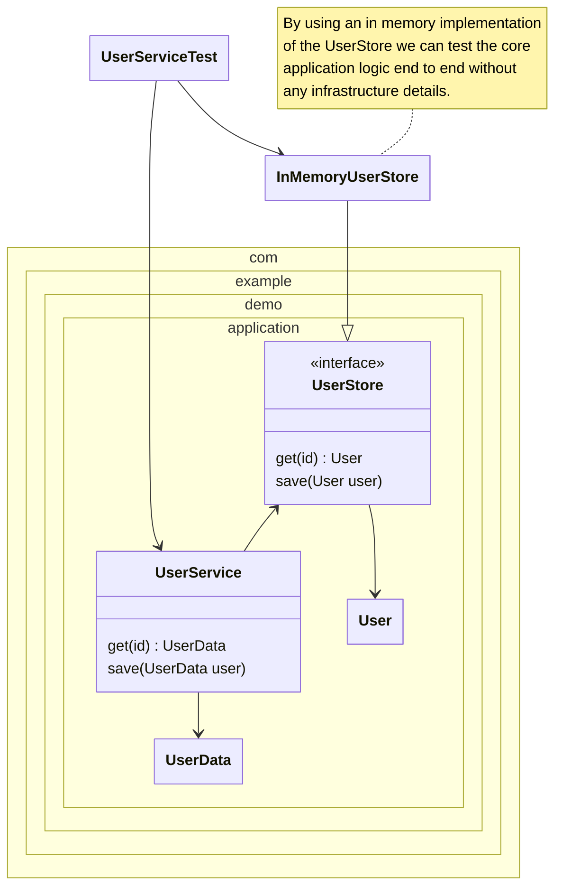

<!--
SPDX-FileCopyrightText: 2025 Digg - Agency for Digital Government

SPDX-License-Identifier: CC0-1.0
-->

# Application test (Draft)

In the application test
we test a piece of application logic without its dependencies.
This is at the core of the Ports and Adapters pattern.
We test the application by sending messages to one of its primary ports
and inspect the result of return values
and calls made to (or state changes in) secondary adapters.

In our exemple, we test by invoking methods on the `UserService`
and inspect the return values.
Instead of using a real database,
we can either us a fake in memory implementation of the `UserStore`
or we could stub it on a test by test basis.

