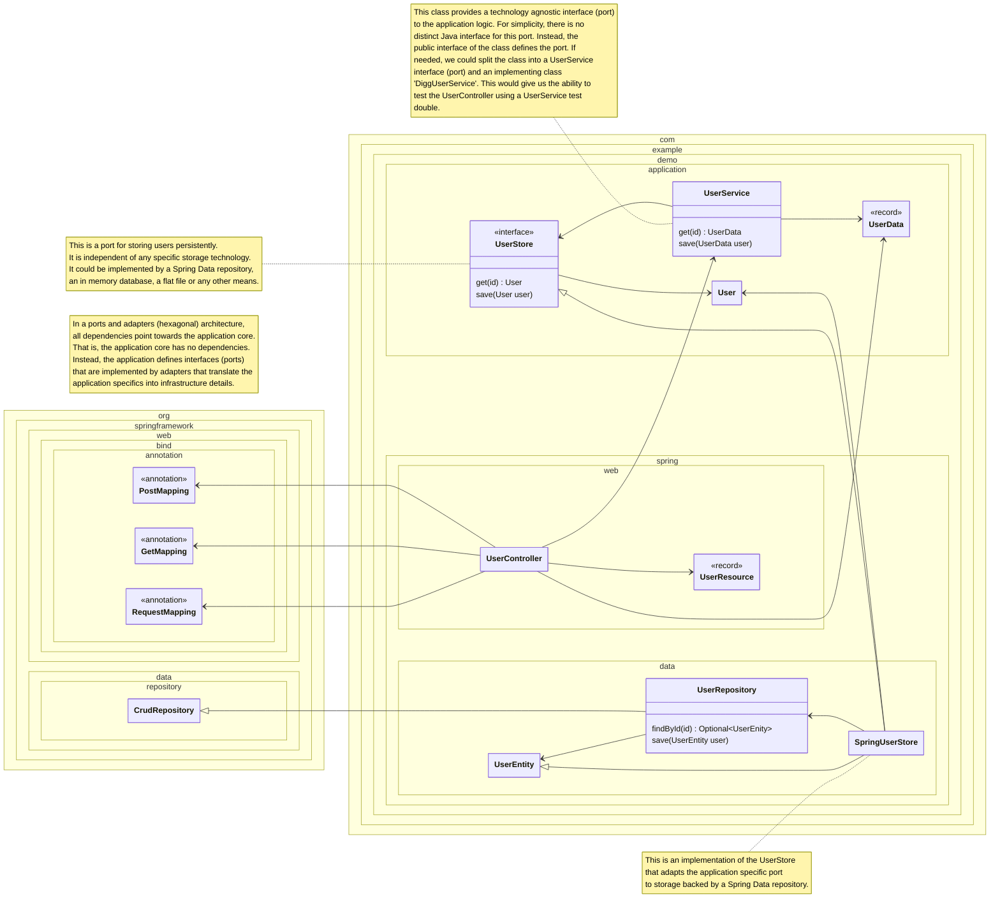

<!--
SPDX-FileCopyrightText: 2025 Digg - Agency for Digital Government

SPDX-License-Identifier: CC0-1.0
-->

# Architecture Overview (Draft)

The architecture proposed here is based on
[the Hexagonal (Ports & Adapters) Architecture](
    https://alistair.cockburn.us/hexagonal-architecture
)
introduced by Alistair Cockburn in 2005.

The main idea is to decouple the application from its external dependencies
so that it can be run and tested without the need of
a user interface, a database, message queues etc.

> Allow an application to equally be driven by
> users, programs, automated test or batch scripts,
> and to be developed and tested in isolation from its eventual run-time devices and databases.

## Ports

To decouple the application from its dependencies,
a set of *ports* (or interfaces) are defined by the application.
These ports are defined in a technology agnostic way
and speaks the language of the appplication.
In other words,
it does not use the terms or defifintions of any technology framework or tool like Spring, JPA or JDBC.

## Adapters

With these ports defined,
it is the responsibility of *adapters* to translate,
or adapt,
the application needs into a particular technology,
e.g. using Spring Data to implemenent persistence
or Spring MVC to map HTTP requests into application logic.

## Primary and secondary adapters

The Ports and Adapters architecture defines two kind of adapters:
*Primary* (or driving) adapters
and *secondary* (or driven) adapters.

> A primary actor is an actor that drives the application
> (takes it out of quiescent state to perform one of its advertised functions).
> A secondary actor is one that the application drives,
> either to get answers from or to merely notify.
> The distinction between primary and secondary lies in who triggers
> or is in charge of the conversation.

## Example architecture

## Testing

With the architecture defined above,
a number of different types of automated tests are possible.
Each of the identified test types are defined in a separate document.

- [Component test](./component-test.md)
- [Application test](./application-test.md)
- [Primary adapter test](./primary-adapter-test.md)
- [Secondary adapter test](./secondary-adapter-test.md)
