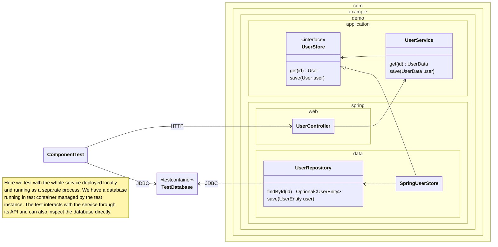

<!--
SPDX-FileCopyrightText: 2025 Digg - Agency for Digital Government

SPDX-License-Identifier: CC0-1.0
-->

# Component Test (Draft)

In the component test
we deploy and run the application as a separate process
and test it through its external interface.
For a REST service,
this means testing by sending HTTP requests
and inspecting the responses.

For persistence,
we are free to choose between a real database
(potentially running in a test container)
or using an in memory implementation of the corresponding adapter.
In the diagram below
we are using a database running in a test container.

