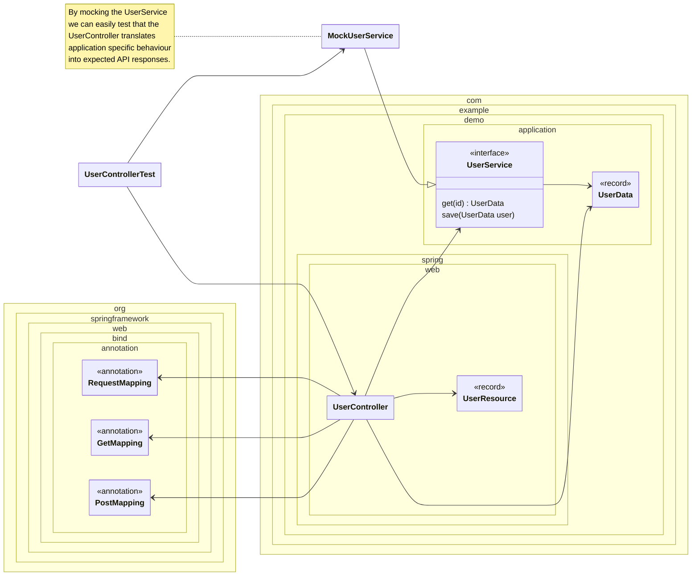

<!--
SPDX-FileCopyrightText: 2025 Digg - Agency for Digital Government

SPDX-License-Identifier: CC0-1.0
-->

# Primary adapter test (Draft)

When testing a primary adapter
we can either write a regular unit test
backed by a mocked version of the primary port
or we could use the real thing
and have test doubles for the secondary adapters.
To have better control and reduce complexity,
it is prefereable to mock the primary port.

In the case of or example,
that means we want to mock the `UserService`.

