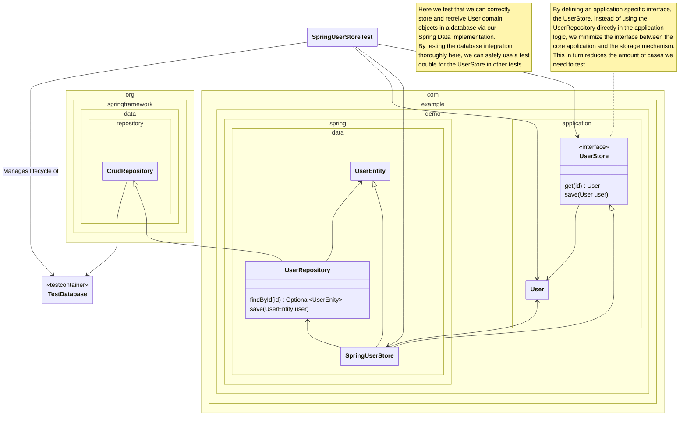

<!--
SPDX-FileCopyrightText: 2025 Digg - Agency for Digital Government

SPDX-License-Identifier: CC0-1.0
-->

# Secondary Adapter Test (Draft)

A secondary (or driven) adapter translates application needs into a particular technology or framework.
Let's consider our `SpringUserStore`.
It adapts the need of the application to retrieve and store users persistently
by leveraging the Spring data framework to store users in a database.
To test this code,
it makes sense to have an integrated test against a real database.
This way we can gain confidence that our use of the framework actually works the way we think.
Should we instead use a mocked database
and only check that the expected calls are made to the database,
our tests would be
more tightly coupled to the implementation,
more likely to break on changes to the production code
and also give us less confidence that the production code actually works.

